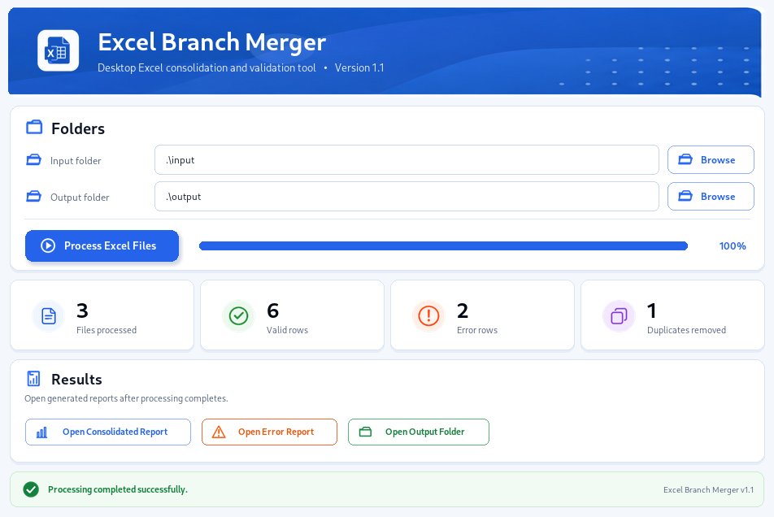

# Excel Branch Merger

A desktop Python application for consolidating, validating, and deduplicating Excel reports from multiple branches.



## Features

- Processes every `.xlsx` file in a selected folder
- Reads all non-empty worksheets
- Maps different source column names to a normalized schema
- Validates required fields, dates, and numeric amounts
- Removes duplicate records using configurable keys
- Generates a consolidated workbook and a separate error report
- Writes a processing log with per-file results
- Runs file processing in a background thread to keep the interface responsive
- Shows per-file progress and summary metrics
- Opens generated reports directly from the application

## Technology

- Python
- Tkinter
- pandas
- openpyxl
- Pillow
- pytest

## Project structure

```text
excel_branch_merger/
├── assets/                    # UI images and icons
├── input/                     # Sample input workbooks
├── output/                    # Generated reports
├── screenshots/               # Application screenshot
├── src/excel_branch_merger/
│   ├── config.py              # Configuration loading
│   ├── merger.py              # Excel processing workflow
│   ├── validators.py          # Normalization and validation
│   └── version.py             # Application metadata
├── tests/                     # Automated tests
├── config.json                # Column aliases and validation rules
├── gui.py                     # Desktop interface
├── main.py                    # Console entry point
├── make_screenshot.py         # Portfolio screenshot generator
├── MAKE_SCREENSHOT.bat        # Windows screenshot launcher
├── requirements.txt
└── pytest.ini
```

## Installation

Create a virtual environment:

```powershell
python -m venv .venv
```

Activate it on Windows:

```powershell
.\.venv\Scripts\Activate.ps1
```

Install dependencies:

```powershell
python -m pip install -r requirements.txt
```

## Running the application

```powershell
python gui.py
```

The Windows launcher can also be used:

```text
START_GUI.bat
```

## Console mode

Place Excel files in the `input` directory and run:

```powershell
python main.py
```

## Configuration

Column aliases, required fields, duplicate keys, and accepted date formats are defined in `config.json`.

Default normalized fields:

- `branch`
- `customer_name`
- `sale_date`
- `amount`
- `invoice_number`

Default required fields:

- `customer_name`
- `sale_date`
- `amount`

Default duplicate key:

- `customer_name`
- `sale_date`
- `amount`
- `invoice_number`

### Date handling

Dates are normalized before deduplication and export. The recommended input format is ISO `YYYY-MM-DD`. Other formats listed in `config.json` are accepted only when they produce one unambiguous calendar date. A value such as `08/04/2026` is rejected when both day-first and month-first formats are enabled, because it could mean either 8 April or 4 August. Ambiguous rows are written to the error report with an instruction to use `YYYY-MM-DD`.

## Output

The application creates:

```text
output/consolidated_report.xlsx
output/error_report.xlsx
output/processing_log.txt
```

The consolidated workbook contains the cleaned records and a summary sheet. The error workbook contains invalid rows and removed duplicates with explanatory messages.

## Portfolio screenshot

Generate an updated application screenshot after changing the interface or icons:

```powershell
python make_screenshot.py
```

The script processes the bundled sample workbooks, displays completed metrics, replaces personal absolute paths with `\.\input` and `\.\output`, and saves the result to:

```text
screenshots/application.png
```

On Windows, `MAKE_SCREENSHOT.bat` runs the same workflow.

## Development

Run the automated tests:

```powershell
python -m pytest -q
```

Start the interface with automatic restart after source or asset changes:

```powershell
python dev_runner.py
```

## License

MIT License. See `LICENSE`.
